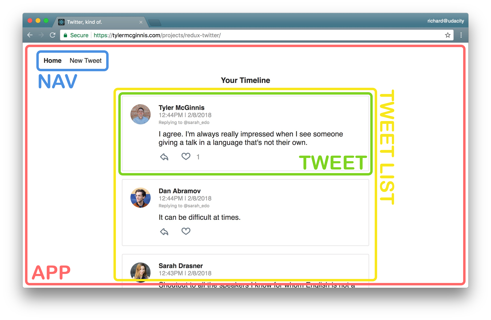
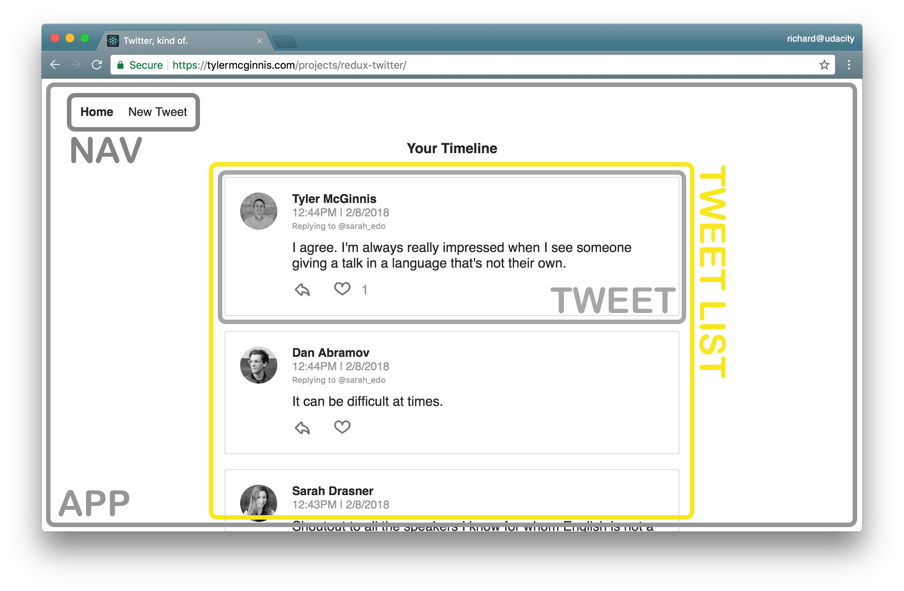
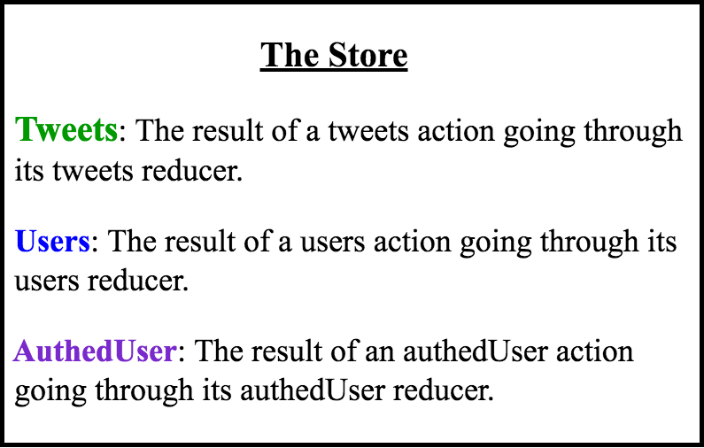

# Chirper Project

This repo is a code-along with the first project in the [React Nanodegree program](https://www.udacity.com/course/react-nanodegree--nd019).

Most of the commits in this repository correspond to videos in the program.

## Project Setup

* clone the Project - `git@github.com:yushanwebdev/reactnd-chirper-app.git`
* install the dependencies - `npm install`

## Planning Stage

### Step 1 - Identify Each View

We need to determine the look and functionality of each view in your app. One of the best approaches is to draw each view of the app on paper so that you'll have a good idea of what information and data you're planning to have on each page.

Instead of paper and pencil, you can be a bit more digital and [use software for creating mockups](https://codingsans.com/blog/mockup-tools). If you were given project specifications, check your mock against them to make sure that you have all of the required features.

For this project, we'll use the screenshots of the app we'll be building instead of mocks.

**<span style="text-decoration:underline;">View for the Dashboard Page</span>**

Let's start by looking at the Dashboard View.


*<center>The "dashboard" view displaying the navigation and tweets.</center>*

**Requirements**
- is located at the home route (`/`)
- shows tweets sorted from most recently added at the top, to oldest at the bottom
- each tweet will show:
  - the author
  - the time stamp
  - who the author is replying to
  - the text of the tweet
  - a reply button - with the number of replies (if higher than 0)
  - a like button - with the number of likes (if higher than 0)

**<span style="text-decoration:underline;">View for the Tweet Page</span>**


*<center>The view for a single tweet.</center>*

**Requirements**
- is located at `/tweet/:id`
- shows an individual tweet
  - the author
  - the time stamp
  - a reply button - with the number of replies (if higher than 0)
  - a like button - with the number of likes (if higher than 0)
- has a reply form
- shows all replies 

**<span style="text-decoration:underline;">View for Creating a New Tweet</span>**


*<center>The view for creating a new Tweet.</center>*

**Requirements**
- is located at `/new`
- has a textbox for adding a new tweet

**<span style="text-decoration:underline;">Recap</span>**

So these are the 3 views we need in our app: 
- Dashboard
- Tweet
- New Tweet

We now have a clear idea of what we're trying to build and can be confident that our views meet all of the provided requirements.

Now, let's move on to Step 2, where we'll make a conceptual skeleton of our app.
<hr/>

### Step 2 - Break Each View Into a Hierarchy of Components
In this step, we'll do 2 things:
- draw boxes around every component
- arrange our components into a hierarchy

**[Q1] How do you know whether something should be a component in a React app?**

[A1] According to the [Thinking in React docs](https://reactjs.org/docs/thinking-in-react.html#step-1-break-the-ui-into-a-component-hierarchy), the Single Responsibility Principle is a great strategy!

**[Q2] Which of the following are true?**

[A2] 
- Components let you split the UI into independent, reusable chunks.
- Each view typically has a component that represents that view.
- Presentation Components don't know where their data comes from.
- Components that are connected to the store are called "containers".
- Use components to your advantage to isolate specific sections of the app, either as access data (containers) or focused on the UI (presentational).
<br/>
<br/>

**<span style="text-decoration:underline;">Components for the Dashboard View</span>**


*<center>Dashboard view broken up into Components.</center>*

Broke this view into the following React Components:
- **App** - the overall container for the project
- **Navigation** - displays the navigation
- **Tweets List** - responsible for the entire list of tweets
- **Tweet** - in charge of display the content for a single tweet

**<span style="text-decoration:underline;">Components for the Tweet View</span>**


*<center>Tweet view broken up into Components.</center>*

Broke this view into the following React Components:
- **App** - the overall container for the project
- **Navigation** - displays the navigation 
- **Tweet Container** - displays a list of tweets
- **Tweet** - displays the content for a single tweet
- **New Tweet** - display the form to create a new tweet (reply)

**<span style="text-decoration:underline;">Components for the New Tweet View</span>**


*<center>New Tweet view broken up into Components.</center>*

Broke this view into the following React Components:
- **App** - the overall container for the project
- **Navigation** - displays the navigation
- **New Tweet** - display the form to create a new tweet

**<span style="text-decoration:underline;">All Components</span>**

So from the way I broke things down, the application will have the following components:
- App
- Navigation
- Tweets List
- Tweet Container
- Tweet
- New Tweet

This component hierarchy tells us which components will be used inside of other components. It gives us the skeleton of our app. All of these are presentational components. Right now, we don't care which components will be upgraded to containers. As we start building out the store, we'll create additional components that will be container components to get data from the store and pass it to the presentational components that need the data.

Thus far, we haven't done anything that's special to Redux; all of the steps above are applicable and useful for React applications that do not use Redux. 

Remember that Redux doesn't care about how our app looks or what components it uses. Instead, it gives a way to manage the state of the application in a predictable way. When we talk about state, we're really talking about data - not just any kind of data inside the app, but data that can change based on the events in the app. 

Let's move on to Step 3, where we'll start thinking about the data in this app.
<hr/>

### Step 3 - Determine What Events Happen in the App

We need to take a look at *what* is happening in each component. Let's determine what actions the app or the user is performing **on the data**. Is the data being set, modified, or deleted?...then we'll need an action to keep track of that event!

**<span style="text-decoration:underline;">Tweets List Component</span>**


*<center>The Tweets List Component</center>*

For the Tweets List component, the only information that we see is that we'll have to get a list of all of the tweets. So for this component, we just need to:
- get the tweets

So the action type for event this will probably be something like `GET_LIST_OF_TWEETS` or `GET_DATA`.

**<span style="text-decoration:underline;">Tweet Component</span>**


*<center>The Tweet Component</center>*

- We get a particular tweet from a list of tweets.
- We get the authedUser (user that is currently logged in) so the user can toggle the likes on each tweet.
- We get the authedUser so the user can reply to a tweet.

**<span style="text-decoration:underline;">Tweet Container Component</span>**


*<center>The Tweet Container Component</center>*

- We get a specific tweet from a list of tweets.
- We get the replies to a specific tweet from a list of tweets.

**<span style="text-decoration:underline;">New Tweet Component</span>**


*<center>The New Tweet Component</center>*

- We get the authedUser so the user can create a new tweet.
- We set the text of the new tweet.

Let's move on to Step 4, where we'll determine which of the data above will live in the store.
<hr/>

### Step 4 - Determine What Data Lives in the Store

Remember that the main problems that Redux (and the react-redux bindings!) was meant to solve were:

- Propagation of props through the entire component tree.
- Ensuring consistency and predictability of the state across the app.

According to Dan Abramov, the creator of Redux, we should follow the following principle for determining whether to store a piece of data in the store or in a React component:

>"Use Redux for state that matters globally or is mutated in complex ways… The rule of thumb is: do whatever is less awkward."

Take a look at [Organizing State](https://redux.js.org/faq/organizing-state) and [How to choose between Redux's store and React's state?](https://github.com/reactjs/redux/issues/1287) for further information about this.

For each piece of data from Step 3, let's see whether it's used by multiple components or mutated in a complex way.

**Text of the new tweet** Used by: New Tweet Component

This piece of data is not used by multiple components and is not mutated in a complex way. That means that it's a great candidate for component state instead of app state that resides in the store.

**Tweets** Used by: Dashboard Component, Tweet Page Component, Tweet Component

In the Tweet Page Component, we need to show the reply tweets. Let's take a look at our starter code in the `_Data.js` file. This is how the tweets are stored in the database:

```javascript
let tweets = {
  tweetId: {
    id: tweetId,
    text: tweetText,
    author: userId,
    timestamp: timestamp,
    likes: [userId1, userId2],
    replies: [tweetId1, tweetId2],
    replyingTo: tweetId_OR_null
  }
};
```
To get the reply tweets, we can get the tweet with a specific id from the list of all of the tweets and access its `replies` property.

In the Dashboard Component, we need to access the current list of tweets. If the Dashboard Component knows the ID of the tweet that needs to be displayed, it can just pass that ID to the Tweet Component, which will render the tweet.

In the Tweet Component, we need to pick out a tweet with a specific id from the current list of tweets. 

That means that we can store the tweets in the store and make the Tweet Page Component, the Dashboard Component, and the Tweet Component into containers (components that have access to the store via the `connect` function).

As soon as that data changes — if someone likes the tweet, for example — all of the components that use that data will update.


*<center>The Store contains a tweets property.</center>*

Keep in mind that each tweet contains the author's name and the author's avatar. One way we could model our state is:

```javascript
tweets: {
  tweetId: {tweetId, authorId, authorName, authorAvatar, timestamp, text, likes, replies, replyingTo},
  tweetId: {tweetId, authorId, authorName, authorAvatar, timestamp, text, likes, replies, replyingTo}
}
```
Modeling the state this way is not wrong, but it's inconvenient if we want to extend the functionality of our application in the future to be able to find tweets made by a particular author. 

Moreover, this way of storing the data mixes the two types of objects:

- tweets data
- user data

This goes against the recommendation to normalize our state. According to the [Redux documentation](https://redux.js.org/recipes/structuring-reducers/normalizing-state-shape), here are the principles of state normalization:

- Each type of data gets its own "table" in the state.
- Each "data table" should store the individual items in an object, with the IDs of the items as keys and the items themselves as the values.
- Any references to individual items should be done by storing the item's ID.
- Arrays of IDs should be used to indicate ordering.

In our application, normalized state would look like this:
```javascript
{
  tweets: {
    tweetId: { tweetId, authorId, timestamp, text, likes, replies, replyingTo},
    tweetId: { tweetId, authorId, timestamp, text, likes, replies, replyingTo}
  },
  users: {
    userId: {userId, userName, avatar, tweetsArray},
    userId: {userId, userName, avatar, tweetsArray}
  }
}
```
Our store at this point:


*<center>The Store contains a tweets property and a users property.</center>*

**authedUser** Used by: Tweet Component, New Tweet Component

Each Tweet Component needs to show whether the logged in used has liked a tweet. In order to do that, we need to know who the logged in user is. From looking at our Component Hierarchy from Step 2, we know that the Tweet Component gets used by multiple components. Therefore, we need to upgrade this component to a container so it could access the `authedUser` piece of data from the store to see whether to show a red heart.

We also know that for every new tweet, we'll have to record who the tweet's author (authedUser) is. The React way of storing state is to put the state in the most parent component and then pass it down to all the children that need it. In this app, that would mean storing in the App Component.

One way to do that is to store the authedUser in the App Component and then pass it down to the components that need access to it. While this works, it's inconvenient. It would be much simpler to just store the autheredUser in the store and then provide the Tweet Component access to the store. The New Tweet Component could then just dispatch an action with the text of the new tweet and the id of the tweet we're replying to as parameters in order to save the new tweet. 

Saving a tweet is an asynchronous operation and we could use redux thunks to do that. Thunks give us access to the store, so we could have the following action creator: 

```javascript
function handleAddTweet(text, replyingTo) {
  return (dispatch, getState) => {
    const { authedUser } = getState();

    return saveTweetToDatabase({
      text,
      author: authedUser,
      replyingTo
    }).then(tweet => dispatch(addTweet(tweet)));
  };
}
```
Generally, accessing the store from an action creator is [considered an anti-pattern](https://stackoverflow.com/questions/35667249/accessing-redux-state-in-an-action-creator/35674575#35674575). Dan Abramov says that the few use cases where it's acceptable to do that are:

>to check cached data before you make a request or to check whether you are authenticated (in other words, doing a conditional dispatch).

Another reason we would want to keep the `authedUser` piece of data in the store is that if we extend our application to include the ability to sign in and sign out, this functionality would be easy to manage with Redux.

The New Tweet Component doesn't need to access the `authedUser` piece of state, but it does need to be able to dispatch an action to let the reducers know that a new tweet has been made. In order to have access to the `dispatch` method, a component must be connected to the store. In other words, it must be a container. So, we know that both the Tweet Component and the New Tweet Component will be upgraded to containers.


*<center>The Store contains a tweets property, a users property, and an authedUser property.</center>*

We are done making our store! While we were making our store, we also determined which components will be upgraded to containers, so our skeleton app is now even more complete.

## Actions

Let's start from the Dashboard View. Our Dashboard View displays a list of tweets and a menu.

We need to take a look at what is happening in this view. Let's determine what actions the app or the user is performing **on the data** - is the data being set, modified, or deleted?

Remember that in Step 4 of the Planning Stage, we determined that our store will look like this:


*<center>The Store contains a tweets property, a users property, and an authedUser property.</center>*

When the app loads, the Dashboard View is displayed. The Dashboard Component therefore needs to:

- get the **tweets**
- get the **users**
- get the **authedUser**

This data is stored in a database. For this view to load all of the tweets (including their author's avatars), we need to 
1. get the tweets and users data from the database; 
2. to pass that data into the component.

**[Q1] Which of the following are best practices for making API requests in React apps? Select all that apply.**

[A1] The `componentDidMount()` lifecycle method.

**[Q2] Which of the following are best practices for making API requests in React/Redux apps?**

[A2] From asynchronous action creators.

Remember how normal Action Creators return actions - simple Javascript objects that then go to all of our reducers? Making an API request is an asynchronous action, so we cannot just send a plain Javascript object to our reducers. Redux middleware can gain access to an action when it's on its way to the reducers. We'll be using the `redux-thunk` middleware in this example. 
 
If the Redux Thunk middleware is enabled (which is done via the `applyMiddleware()` function), then any time your action creator returns a function instead of a Javascript object, it will go to the `redux-thunk` middleware.

Dan Abramov [describes](https://stackoverflow.com/questions/35411423/how-to-dispatch-a-redux-action-with-a-timeout/35415559#35415559) what happens next: 

>“The middleware will call that function with dispatch method itself as the first argument...The action will only reach the reducers once the API request is completed. It will also “swallow” such actions so don't worry about your reducers receiving weird function arguments. Your reducers will only receive plain object actions—either emitted directly, or emitted by the functions as we just described.”

Here's what a thunk action creator looks like:

```javascript
function handleInitialData () { 
 return function (dispatch) {}
}
```
Which is equivalent to this in ES6:

```javascript
function handleInitialData () {
 return (dispatch) => {}
}
```
Now, we need to give our components access to the data that came in. In other words, we need to populate the store with `tweets` and `users`.


*<center>The Model of Our Store</center>*

The **tweets** slice of the state in the store will be modified by actions that go through the tweets reducer. 

The **users** slice of the state in the store will be modified by actions that go through the users reducer. 

And, similarly, the **authedUser** portion of the state in the store will be modified by actions that go through the authedUser reducer.


## Contributing

Because this is a code-along project and the commits correspond to specific videos in the program.

If you feel like there's a major problem, please open an issue to discuss the problem and potential resolution.
