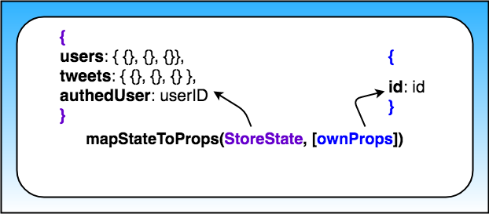

# Chirper Project

This repo is a code-along with the first project in the [React Nanodegree program](https://www.udacity.com/course/react-nanodegree--nd019).

Most of the commits in this repository correspond to videos in the program.

## Project Setup

* clone the Project - `git@github.com:yushanwebdev/reactnd-chirper-app.git`
* install the dependencies - `npm install`

## Planning Stage

### Step 1 - Identify Each View

We need to determine the look and functionality of each view in your app. One of the best approaches is to draw each view of the app on paper so that you'll have a good idea of what information and data you're planning to have on each page.

Instead of paper and pencil, you can be a bit more digital and [use software for creating mockups](https://codingsans.com/blog/mockup-tools). If you were given project specifications, check your mock against them to make sure that you have all of the required features.

For this project, we'll use the screenshots of the app we'll be building instead of mocks.

**<span style="text-decoration:underline;">View for the Dashboard Page</span>**

Let's start by looking at the Dashboard View.


*<center>The "dashboard" view displaying the navigation and tweets.</center>*

**Requirements**
- is located at the home route (`/`)
- shows tweets sorted from most recently added at the top, to oldest at the bottom
- each tweet will show:
  - the author
  - the time stamp
  - who the author is replying to
  - the text of the tweet
  - a reply button - with the number of replies (if higher than 0)
  - a like button - with the number of likes (if higher than 0)

**<span style="text-decoration:underline;">View for the Tweet Page</span>**


*<center>The view for a single tweet.</center>*

**Requirements**
- is located at `/tweet/:id`
- shows an individual tweet
  - the author
  - the time stamp
  - a reply button - with the number of replies (if higher than 0)
  - a like button - with the number of likes (if higher than 0)
- has a reply form
- shows all replies 

**<span style="text-decoration:underline;">View for Creating a New Tweet</span>**


*<center>The view for creating a new Tweet.</center>*

**Requirements**
- is located at `/new`
- has a textbox for adding a new tweet

**<span style="text-decoration:underline;">Recap</span>**

So these are the 3 views we need in our app: 
- Dashboard
- Tweet
- New Tweet

We now have a clear idea of what we're trying to build and can be confident that our views meet all of the provided requirements.

Now, let's move on to Step 2, where we'll make a conceptual skeleton of our app.
<hr/>

### Step 2 - Break Each View Into a Hierarchy of Components
In this step, we'll do 2 things:
- draw boxes around every component
- arrange our components into a hierarchy

**[Q1] How do you know whether something should be a component in a React app?**

[A1] According to the [Thinking in React docs](https://reactjs.org/docs/thinking-in-react.html#step-1-break-the-ui-into-a-component-hierarchy), the Single Responsibility Principle is a great strategy!

**[Q2] Which of the following are true?**

[A2] 
- Components let you split the UI into independent, reusable chunks.
- Each view typically has a component that represents that view.
- Presentation Components don't know where their data comes from.
- Components that are connected to the store are called "containers".
- Use components to your advantage to isolate specific sections of the app, either as access data (containers) or focused on the UI (presentational).
<br/>
<br/>

**<span style="text-decoration:underline;">Components for the Dashboard View</span>**


*<center>Dashboard view broken up into Components.</center>*

Broke this view into the following React Components:
- **App** - the overall container for the project
- **Navigation** - displays the navigation
- **Tweets List** - responsible for the entire list of tweets
- **Tweet** - in charge of display the content for a single tweet

**<span style="text-decoration:underline;">Components for the Tweet View</span>**


*<center>Tweet view broken up into Components.</center>*

Broke this view into the following React Components:
- **App** - the overall container for the project
- **Navigation** - displays the navigation 
- **Tweet Container** - displays a list of tweets
- **Tweet** - displays the content for a single tweet
- **New Tweet** - display the form to create a new tweet (reply)

**<span style="text-decoration:underline;">Components for the New Tweet View</span>**


*<center>New Tweet view broken up into Components.</center>*

Broke this view into the following React Components:
- **App** - the overall container for the project
- **Navigation** - displays the navigation
- **New Tweet** - display the form to create a new tweet

**<span style="text-decoration:underline;">All Components</span>**

So from the way I broke things down, the application will have the following components:
- App
- Navigation
- Tweets List
- Tweet Container
- Tweet
- New Tweet

This component hierarchy tells us which components will be used inside of other components. It gives us the skeleton of our app. All of these are presentational components. Right now, we don't care which components will be upgraded to containers. As we start building out the store, we'll create additional components that will be container components to get data from the store and pass it to the presentational components that need the data.

Thus far, we haven't done anything that's special to Redux; all of the steps above are applicable and useful for React applications that do not use Redux. 

Remember that Redux doesn't care about how our app looks or what components it uses. Instead, it gives a way to manage the state of the application in a predictable way. When we talk about state, we're really talking about data - not just any kind of data inside the app, but data that can change based on the events in the app. 

Let's move on to Step 3, where we'll start thinking about the data in this app.
<hr/>

### Step 3 - Determine What Events Happen in the App

We need to take a look at *what* is happening in each component. Let's determine what actions the app or the user is performing **on the data**. Is the data being set, modified, or deleted?...then we'll need an action to keep track of that event!

**<span style="text-decoration:underline;">Tweets List Component</span>**


*<center>The Tweets List Component</center>*

For the Tweets List component, the only information that we see is that we'll have to get a list of all of the tweets. So for this component, we just need to:
- get the tweets

So the action type for event this will probably be something like `GET_LIST_OF_TWEETS` or `GET_DATA`.

**<span style="text-decoration:underline;">Tweet Component</span>**


*<center>The Tweet Component</center>*

- We get a particular tweet from a list of tweets.
- We get the authedUser (user that is currently logged in) so the user can toggle the likes on each tweet.
- We get the authedUser so the user can reply to a tweet.

**<span style="text-decoration:underline;">Tweet Container Component</span>**


*<center>The Tweet Container Component</center>*

- We get a specific tweet from a list of tweets.
- We get the replies to a specific tweet from a list of tweets.

**<span style="text-decoration:underline;">New Tweet Component</span>**


*<center>The New Tweet Component</center>*

- We get the authedUser so the user can create a new tweet.
- We set the text of the new tweet.

Let's move on to Step 4, where we'll determine which of the data above will live in the store.
<hr/>

### Step 4 - Determine What Data Lives in the Store

Remember that the main problems that Redux (and the react-redux bindings!) was meant to solve were:

- Propagation of props through the entire component tree.
- Ensuring consistency and predictability of the state across the app.

According to Dan Abramov, the creator of Redux, we should follow the following principle for determining whether to store a piece of data in the store or in a React component:

>"Use Redux for state that matters globally or is mutated in complex ways… The rule of thumb is: do whatever is less awkward."

Take a look at [Organizing State](https://redux.js.org/faq/organizing-state) and [How to choose between Redux's store and React's state?](https://github.com/reactjs/redux/issues/1287) for further information about this.

For each piece of data from Step 3, let's see whether it's used by multiple components or mutated in a complex way.

**Text of the new tweet** Used by: New Tweet Component

This piece of data is not used by multiple components and is not mutated in a complex way. That means that it's a great candidate for component state instead of app state that resides in the store.

**Tweets** Used by: Dashboard Component, Tweet Page Component, Tweet Component

In the Tweet Page Component, we need to show the reply tweets. Let's take a look at our starter code in the `_Data.js` file. This is how the tweets are stored in the database:

```javascript
let tweets = {
  tweetId: {
    id: tweetId,
    text: tweetText,
    author: userId,
    timestamp: timestamp,
    likes: [userId1, userId2],
    replies: [tweetId1, tweetId2],
    replyingTo: tweetId_OR_null
  }
};
```
To get the reply tweets, we can get the tweet with a specific id from the list of all of the tweets and access its `replies` property.

In the Dashboard Component, we need to access the current list of tweets. If the Dashboard Component knows the ID of the tweet that needs to be displayed, it can just pass that ID to the Tweet Component, which will render the tweet.

In the Tweet Component, we need to pick out a tweet with a specific id from the current list of tweets. 

That means that we can store the tweets in the store and make the Tweet Page Component, the Dashboard Component, and the Tweet Component into containers (components that have access to the store via the `connect` function).

As soon as that data changes — if someone likes the tweet, for example — all of the components that use that data will update.


*<center>The Store contains a tweets property.</center>*

Keep in mind that each tweet contains the author's name and the author's avatar. One way we could model our state is:

```javascript
tweets: {
  tweetId: {tweetId, authorId, authorName, authorAvatar, timestamp, text, likes, replies, replyingTo},
  tweetId: {tweetId, authorId, authorName, authorAvatar, timestamp, text, likes, replies, replyingTo}
}
```
Modeling the state this way is not wrong, but it's inconvenient if we want to extend the functionality of our application in the future to be able to find tweets made by a particular author. 

Moreover, this way of storing the data mixes the two types of objects:

- tweets data
- user data

This goes against the recommendation to normalize our state. According to the [Redux documentation](https://redux.js.org/recipes/structuring-reducers/normalizing-state-shape), here are the principles of state normalization:

- Each type of data gets its own "table" in the state.
- Each "data table" should store the individual items in an object, with the IDs of the items as keys and the items themselves as the values.
- Any references to individual items should be done by storing the item's ID.
- Arrays of IDs should be used to indicate ordering.

In our application, normalized state would look like this:
```javascript
{
  tweets: {
    tweetId: { tweetId, authorId, timestamp, text, likes, replies, replyingTo},
    tweetId: { tweetId, authorId, timestamp, text, likes, replies, replyingTo}
  },
  users: {
    userId: {userId, userName, avatar, tweetsArray},
    userId: {userId, userName, avatar, tweetsArray}
  }
}
```
Our store at this point:


*<center>The Store contains a tweets property and a users property.</center>*

**authedUser** Used by: Tweet Component, New Tweet Component

Each Tweet Component needs to show whether the logged in used has liked a tweet. In order to do that, we need to know who the logged in user is. From looking at our Component Hierarchy from Step 2, we know that the Tweet Component gets used by multiple components. Therefore, we need to upgrade this component to a container so it could access the `authedUser` piece of data from the store to see whether to show a red heart.

We also know that for every new tweet, we'll have to record who the tweet's author (authedUser) is. The React way of storing state is to put the state in the most parent component and then pass it down to all the children that need it. In this app, that would mean storing in the App Component.

One way to do that is to store the authedUser in the App Component and then pass it down to the components that need access to it. While this works, it's inconvenient. It would be much simpler to just store the autheredUser in the store and then provide the Tweet Component access to the store. The New Tweet Component could then just dispatch an action with the text of the new tweet and the id of the tweet we're replying to as parameters in order to save the new tweet. 

Saving a tweet is an asynchronous operation and we could use redux thunks to do that. Thunks give us access to the store, so we could have the following action creator: 

```javascript
function handleAddTweet(text, replyingTo) {
  return (dispatch, getState) => {
    const { authedUser } = getState();

    return saveTweetToDatabase({
      text,
      author: authedUser,
      replyingTo
    }).then(tweet => dispatch(addTweet(tweet)));
  };
}
```
Generally, accessing the store from an action creator is [considered an anti-pattern](https://stackoverflow.com/questions/35667249/accessing-redux-state-in-an-action-creator/35674575#35674575). Dan Abramov says that the few use cases where it's acceptable to do that are:

>to check cached data before you make a request or to check whether you are authenticated (in other words, doing a conditional dispatch).

Another reason we would want to keep the `authedUser` piece of data in the store is that if we extend our application to include the ability to sign in and sign out, this functionality would be easy to manage with Redux.

The New Tweet Component doesn't need to access the `authedUser` piece of state, but it does need to be able to dispatch an action to let the reducers know that a new tweet has been made. In order to have access to the `dispatch` method, a component must be connected to the store. In other words, it must be a container. So, we know that both the Tweet Component and the New Tweet Component will be upgraded to containers.


*<center>The Store contains a tweets property, a users property, and an authedUser property.</center>*

We are done making our store! While we were making our store, we also determined which components will be upgraded to containers, so our skeleton app is now even more complete.

## Actions

Let's start from the Dashboard View. Our Dashboard View displays a list of tweets and a menu.

We need to take a look at what is happening in this view. Let's determine what actions the app or the user is performing **on the data** - is the data being set, modified, or deleted?

Remember that in Step 4 of the Planning Stage, we determined that our store will look like this:


*<center>The Store contains a tweets property, a users property, and an authedUser property.</center>*

When the app loads, the Dashboard View is displayed. The Dashboard Component therefore needs to:

- get the **tweets**
- get the **users**
- get the **authedUser**

This data is stored in a database. For this view to load all of the tweets (including their author's avatars), we need to 
1. get the tweets and users data from the database; 
2. to pass that data into the component.

**[Q1] Which of the following are best practices for making API requests in React apps? Select all that apply.**

[A1] The `componentDidMount()` lifecycle method.

**[Q2] Which of the following are best practices for making API requests in React/Redux apps?**

[A2] From asynchronous action creators.

Remember how normal Action Creators return actions - simple Javascript objects that then go to all of our reducers? Making an API request is an asynchronous action, so we cannot just send a plain Javascript object to our reducers. Redux middleware can gain access to an action when it's on its way to the reducers. We'll be using the `redux-thunk` middleware in this example. 
 
If the Redux Thunk middleware is enabled (which is done via the `applyMiddleware()` function), then any time your action creator returns a function instead of a Javascript object, it will go to the `redux-thunk` middleware.

Dan Abramov [describes](https://stackoverflow.com/questions/35411423/how-to-dispatch-a-redux-action-with-a-timeout/35415559#35415559) what happens next: 

>“The middleware will call that function with dispatch method itself as the first argument...The action will only reach the reducers once the API request is completed. It will also “swallow” such actions so don't worry about your reducers receiving weird function arguments. Your reducers will only receive plain object actions—either emitted directly, or emitted by the functions as we just described.”

Here's what a thunk action creator looks like:

```javascript
function handleInitialData () { 
 return function (dispatch) {}
}
```
Which is equivalent to this in ES6:

```javascript
function handleInitialData () {
 return (dispatch) => {}
}
```
Now, we need to give our components access to the data that came in. In other words, we need to populate the store with `tweets` and `users`.


*<center>The Model of Our Store</center>*

The **tweets** slice of the state in the store will be modified by actions that go through the tweets reducer. 

The **users** slice of the state in the store will be modified by actions that go through the users reducer. 

And, similarly, the **authedUser** portion of the state in the store will be modified by actions that go through the authedUser reducer.

[First Actions](https://www.youtube.com/watch?v=Px3vpZBHhHI)

[Authorized User Action](https://www.youtube.com/watch?v=-cqWNcFKB5E)

## Reducers

A [Reducer](https://redux.js.org/tutorials/fundamentals/part-3-state-actions-reducers) describes how an application's state changes. You’ll often see the [Object Spread Operator](https://redux.js.org/recipes/using-object-spread-operator) (`...`) used inside of a reducer because a reducer **must return a new object** instead of mutating the old state.

If you want to know why Redux requires immutability, check out the [Immutable Data Section of the docs](https://redux.js.org/faq/immutable-data#why-is-immutability-required).

Reducers have the following signature:

```javascript
(previousState, action) => newState
```
In our app, the `tweets` reducer will determine how the `tweets` part of the state changes. The `users` reducer will determine how the `users` part of the state changes, and so forth:


*<center>This is how our state will be modified.</center>*

## Initializing State

There are 2 ways to initialize the state inside the store:

- You can pass the initial state (or a part of the initial state) as `preloadedState` to the `createStore` function.

For Example:
```javascript
const store = createStore (
  rootReducer,
  { tweets: {} }
);
```
- You can include a default state parameter as the first argument inside a particular reducer function.

For example: 
```javascript
function tweets (state = {}, action) {
}
```
To see how these approaches interact, check out the Initializing State section of the documentation.

To see how these approaches interact, check out the [Initializing State section of the documentation](https://redux.js.org/recipes/structuring-reducers/initializing-state).

[Reducers](https://www.youtube.com/watch?v=QnntUz8r9lo)

In our app, we initialized each slice of the store by setting a default `state` value as the first parameter inside each reducer function.

At this point, our store looks like this:


*<center>Initialized State Inside the Store</center>*

The **tweets** slice of the state in the store has been initialized to an empty object. The **users** slice of the state in the store has been initialized to an empty object. And, the **authedUser** slice of the state in the store has been initialized to null.

So, we have a `tweets` to manage the tweets slice of the state, a `users` reducer to manage the users slice of the state, and an `authedUser` reducer to manage the *authedUser* portion of the state. Each of these reducers will manage just its own part of the state. 

We will combine all of these reducers into one main, root reducer, which will combine the results of calling the `tweets` reducer, `users` reducer, and `authedUser` reducer into a single state object. Remember, we need to do this because the `createStore` function only accepts a single reducer.

```javascript
combineReducers({
  authedUser: authedUser,
  tweets: tweets,
  users: users
});
```
Or using ES6's [property shorthand](https://developer.mozilla.org/en-US/docs/Web/JavaScript/Reference/Operators/Object_initializer), it can just be:
```javascript
combineReducers({
  authedUser,
  tweets,
  users
});
```
Now that all of our reducers are set up, we need to actually create the store and provide it to our application. To actually use any of the code that we've written up to this point, we need to install the `redux` package. Then, to provide the store to our application, we'll also need to install the `react-redux` package.

[Creating The Store](https://www.youtube.com/watch?v=Ac3-sWH49XY)

Redux applications have a single store. We have to pass the Root Reducer to our `createStore()` function in order for the store to know what pieces of state it should have.

The point of creating a store is to allow components to be able to access it without having to pass the data down through multiple components. The `Provider` component (which comes from the `react-redux` package) makes it possible for all components to access the store via the `connect()` function.

## Middleware

Our last bit of setup involves setting up the app's Middleware functions. Just like in the previous Todos application, we're going to create a logger middleware that will help us view the actions and state of the store as we interact with our application. Also, since the `handleInitialData()` action creator in src/actions/shared.js returns a function, we'll need to install the `react-thunk` package:

In the next video, we’ll hook up our redux-thunk middleware, so our thunk action creators actually work. We’ll also put in logger middleware to make debugging easier. Do you remember how to build custom middleware?

All middleware follows this currying pattern:

```javascript
const logger = (store) => (next) => (action) => {
 // ...
}
```
Use the [Babel Repl](https://babeljs.io/repl/#?browsers=&build=&builtIns=false&spec=false&loose=false&code_lz=Q&debug=false&forceAllTransforms=false&shippedProposals=false&circleciRepo=&evaluate=true&fileSize=false&timeTravel=false&sourceType=module&lineWrap=false&presets=&prettier=false&targets=&version=6.26.0&externalPlugins=) if you want to see this code in ES5.

The variable `logger` is assigned to a function that takes the `store` as its argument. That function returns another function, which is passed `next` (which is the next middleware in line or the dispatch function). That other function return another function which is passed an `action`. Once inside that third function, we have access to `store`, `next`, and `action`.

It’s important to note that the value of the `next` parameter will be determined by the `applyMiddleware` function. Why? All middleware will be called in the order it is listed in that function. In our case, the `next` will be `dispatch` because `logger` is the last middleware listed in that function.

[Project Middleware](https://www.youtube.com/watch?v=HXYqXy4uflw)

Here’s our middleware wiring: 
```javascript
export default applyMiddleware(
  thunk,
  logger
);
```
Each thing returned by an action creator - be it an action or a function - will go through our thunk middleware. This is the source code for the thunk middleware:
```javascript
function createThunkMiddleware(extraArgument) {
  return ({ dispatch, getState }) => next => action => {
    if (typeof action === 'function') {
      return action(dispatch, getState, extraArgument);
    }
    return next(action);
  };
}

const thunk = createThunkMiddleware();
thunk.withExtraArgument = createThunkMiddleware;

export default thunk;
```

If the thunk middleware sees an action, that action will be sent to the next middleware in line - the logger middleware. If it sees a function, the `thunk` middleware will call that function. That function can contain side effects - such as API calls - and dispatch actions, simple Javascript objects. These dispatched actions will again go to all of the middleware. The thunk middleware will see that it’s a simple action and pass the action on to the next middleware, the logger.

**[Q] Would these two pieces of code make the logger produce the same output in the console?**
```javascript
export default applyMiddleware(
  logger,
  thunk
);
```
```javascript
export default applyMiddleware(
  thunk,
  logger
);
```
[A] No.

Reason - The middleware is called in the order it is listed in this function. The thunk action creators we're using to load initial date, save tweets, and toggle tweets are functions. So if they go to the logger middleware before going to the thunk middleware (which takes the functions and executes them, thereby obtaining `actions` to pass to the reducers), we're going to be logging function, not the actual actions.

## Initializing the App's Data

We have previously determined that we need to get the `users` and `tweets` data from our database and send that data to our store, along with the `authedUser` data, when the home page loads.

We have also created a thunk action creator that gets the data from the database and then dispatches actions to the store to set the three pieces of state we have in our store:
- users
- tweets
- authedUser

Here's what the `handleInitialData()` thunk action creator looks like:

```javascript
function handleInitialData () {
  return (dispatch) => {
    return getInitialData()
      .then(({ users, tweets }) => {
        dispatch(receiveUsers(users));
        dispatch(receiveTweets(tweets));
        dispatch(setAuthedUser(AUTHED_ID));
      });
  };
}
```
Now, the question is where do we dispatch this action creator?

**[Q] Think about this for a moment - Will our app work as desired if we dispatch the `handleInitialData()` action creator inside of the Dashboard Component?**

[A] No.

Reason - It is true that the root route will load correctly, but if we go to a different route -- tweets/:id, for example -- our store will still be empty and the tweet will not be found.

When we walked through the architecture of our app, we saw that the App Component will contain every other component. If we load the initial data (by dispatching the handleInitialData() action creator) from the App component, then no matter which route our users goes to, they’ll see all of the correct data.

[Initial Data](https://www.youtube.com/watch?v=ydXVJmVqebQ)

Using the `connect()` function upgrades a component to a container. Containers can read state from the store and dispatch actions. Read more about our ability to customize our container’s relationship with the store in the `react-redux` [API documentation](https://react-redux.js.org/). Make sure to go through the excellent examples that are provided in the linked documentation to gain a deeper understanding of Redux.

## Dashboard Component 

In Step 4 of the Planning Stage, we determined that our store should look like this:

In our application, normalized state would look like this:

```javascript
{
  tweets: {
    tweetId: { tweet id, author’s id, timestamp, text, likes, replies, replyingTo},
    tweetId: { tweet id, author’s id, timestamp, text, likes, replies, replyingTo}
  },
  users: {
    userId: {user’s id, user’s name, avatar, tweets array},
    userId: {user’s id, user’s name, avatar, tweets array}
  }
}
```
In the Planning Stage, we also determined that the Dashboard Component will be a container since it will need access to the tweets part of the store in order to display the list of tweets.

To make a container, we need to make use the `connect()` function. Remember that the signature of the connect function looks like this:

```javascript
connect([mapStateToProps], [mapDispatchToProps], [mergeProps], [options])
```

Take a look at the [react-redux documentation](https://react-redux.js.org/) if you need a refresher.

These details about `mapStateToProps` and `mapDispatchToProps` are crucial:

> *mapStateToProps - If this argument is specified, the new component will subscribe to Redux store updates. This means that any time the store is updated, mapStateToProps will be called. The results of mapStateToProps must be a plain object, which will be merged into the component’s props. If you don't want to subscribe to store updates, pass null or undefined in place of mapStateToProps.*

> *mapDispatchToProps - If an object is passed, each function inside it is assumed to be a Redux action creator. An object with the same function names, but with every action creator wrapped into a dispatch call so they may be invoked directly, will be merged into the component’s props. If a function is passed, it will be given dispatch as the first parameter. It’s up to you to return an object that somehow uses dispatch to bind action creators in your own way. (Tip: you may use the [bindActionCreators()](https://redux.js.org/api/bindactioncreators) helper from Redux.)*

Do you remember the Component Hierarchy we made in Step 2 of the Planning Stage? We said that the Tweet Component will be inside of the Dashboard Component. If the Dashboard Component knows the ID of the tweet that needs to be displayed, it can just pass that ID to the Tweet Component, which will render the tweet.

Remember that the signature of the mapStateToProps function is:

```javascript
mapStateToProps(state, [ownProps])
```

- `state` is the state inside the store
- `ownProps` are the properties that have been passed to this component from a parent component

Since we only care about the `tweets` part of the store, we can use destructuring to pass the `tweets` part of the state in the store as the parameter to the `mapStateToProps()` function.


*<center>The breakdown of our `mapStateToProps` function</center>*

So this is what the Dashboard Component's mapStateToProps() function looks like

The important things to note are that:
- **tweets** is the slice of the state that this component cares about
- **tweetIds** will show up as a property on this container

[Dashboard](https://www.youtube.com/watch?v=xjqf3vm3KjY)

## Tweet Component

In Step 4 of the Planning Stage, we saw that this component will need access to the following data:
- users
- tweets
- authedUser

Let's connect this component to the store!

[Tweet State](https://www.youtube.com/watch?v=Q6sAKQaQTJ8)

Notice how we're passing an id prop along to the Tweet component:

```javascript
<Tweet id={id} />
```

Because we're doing this, the `mapStateToProps` function's second argument (`ownProps`) will be an object that has an `id` property with this value.


*<center>Arguments inside the `mapStateToProps` function</center>*

So as of right now, this is what the mapStateToProps function looks like:
```javascript
function mapStateToProps ({authedUser, users, tweets}, { id }) {
  const tweet = tweets[id];

  return {
    authedUser,
    tweet: formatTweet(tweet, users[tweet.author], authedUser)
  };
}
```
The important thing to notice here is that `mapStateToProps` accepts two arguments:
- the state of the store
- the props passed to the Tweet component

We're destructuring both arguments. From the store, we're extracting:
- the `authedUser` data 
- the `users` data
- the `tweets` data

Then we're getting the `id` from the props passed to the Tweets Component. We need both of these pieces of data (coming from the store's state and coming from the component) so that we can determine which Tweet should be displayed by Tweet Component.

[Handling A Parent Tweet](https://www.youtube.com/watch?v=fNHUigCJpkY)

So this is what the final state of the Tweet Component's `mapStateToProps` function looks like:

```javascript
function mapStateToProps ({authedUser, users, tweets}, { id }) {
  const tweet = tweets[id];
  const parentTweet = tweet ? tweets[tweet.replyingTo] : null;

  return {
    authedUser,
    tweet: tweet
      ? formatTweet(tweet, users[tweet.author], authedUser, parentTweet)
      : null
  };
}
```

Now that we're getting all of the data we need from the store, we can actually build the UI for the Tweet Component. 

[Tweet UI](https://www.youtube.com/watch?v=es890SLMDqM)

[Loading](https://www.youtube.com/watch?v=FvmgIlJPjQ8)

**Further Research:**
- [The Perils of Using a Common Redux Anti-Patterns](https://itnext.io/the-perils-of-using-a-common-redux-anti-pattern-344d778e59da)

## Liking a Tweet

In the Planning stage, we figured out that we needed to give the Tweet Component access to the `authedUser` data for the tweet to correctly show whether the logged in user liked the tweet or not and for the user to reply to tweets. We also figured out that once the user likes or un-likes a tweet, that information needs to be reflected in the store for other components show the correct data.

We’ll need to write an asynchronous action creator since we need to record whether the logged in user liked a tweet not only in the store but also in our database. [Redux thunks](https://github.com/reduxjs/redux-thunk) to the rescue! 


*<center>A Thunk Action Creator returns a function that will be passed `store.dispatch` and `store.getState` when it's invoked.</center>*

We can write this as our thunk action creator:

```javascript
function handleToggleTweet (info) {
  return (dispatch) => {
    saveLikeToggle(info)
    .then(() => {
      dispatch(toggleTweet(info));
      })
    .catch((e) => {
      console.warn('Error in handleToggleTweet: ', e);
      alert('There was an error liking the tweet. Try again.');
    });
  }
}
```
Our code only updates the UI once we receive confirmation that the backend update was successful. This can make the app seem laggy. 

A common approach to UI updates is Optimistic Updating; updating the UI before the action gets recorded on the backend so it seems more performant. We’ll see that approach in the video below as we build out our Tweet Actions.

[Like Tweet Actions](https://www.youtube.com/watch?v=2YTZZJTs4aw)

### Like Tweet Reducer

Remember that the `tweets` reducer will determine how the `tweets` part of the state changes:


*<center>Each reducer modifies its own slice of the state.</center>*

When liking a tweet (or unliking a tweet), the state for that specific tweet needs to change - either the tweet's `like` property (which, if you remember, is an array and will contain the names of the users that have liked the tweet) will need to change to include the user that clicked it (if they're liking the tweet) or the user's name will need to be removed from the array (if they're unliking the tweet).

So we need to update the reducer to handle these changes.

[Like Tweet Reducer](https://www.youtube.com/watch?v=bHklEREK6gw)

[Like Tweet Component](https://www.youtube.com/watch?v=hPvYle9FdBk)

## New Tweet Component

[New Tweet UI](https://www.youtube.com/watch?v=aEAUnJhyqCw)

### Adding a New Tweet

Let’s now work on the logic of adding a new tweet. Once the user submits a new tweet, it should show up in the list of all of tweets and be added to our database. Since this tweet will be used by more than one component, we know that we want to make sure the store is modified to reflect the updated list of tweets. Recording tweets in a database is an asynchronous operation, so we can use Redux Thunk to issue the API request.

[New Tweet Logic Actions](https://www.youtube.com/watch?v=MyjJlyv2H0I)

We know that our store looks like this:

```javascript
{
  tweets: {
    tweetId: { tweetId, authorId, timestamp, text, likes, replies, replyingTo}, 
    tweetId: { tweetId, authorId, timestamp, text, likes, replies, replyingTo}
  },
  users: {
    userId: {userId, userName, avatar, tweets array},
    userId: {userId, userName, avatar, tweets array}
  },
  authedUser: userId
}
```
Let’s start working on the New Tweet Reducer. How will we be modifying the state to reflect the new tweet?

This is going to be a two-part process:

1. the new tweet needs to be added to the list of tweets
2. an already existing tweet needs to be modified if the new tweet is a response to another tweet

In this reducer, we'll

1. concatenate the new tweet to the list of the already-existing tweets. Remember that the [object spread operator](https://redux.js.org/recipes/using-object-spread-operator) offers us the most concise way of doing that;
2. modify the `replies` property of the tweet the new tweet is replying to.

[New Tweet Logic Reducer](https://www.youtube.com/watch?v=YdmgH1-U5jM)

[New Tweet Logic Component](https://www.youtube.com/watch?v=hWGIn12dGOM)

In Step 2 of the Planning Stage, we determined that the New Tweet Component will show up inside of the App Component when the user goes to the `/new` page and that it will be inside of the Tweet Page Component when the user is on the `/tweet/:id` page. 

When the user is at the `/new` route, the new tweet will not be attached to another tweet. When the user is at the `tweet/:id` route, the new tweet will be attached to the already-displayed tweet. Notice that the route already contains the parent tweet’s `id`. We can just pass the `id` from the route to the New Tweet Component whenever we’re creating a reply tweet.

What happens when someone clicks “Submit” to add a new tweet? The New Tweet Component will need to communicate with our store. We communicate with the store by dispatching actions. `dispatch` is a method on the store. That means that the New Tweet Component needs to be `connect()`ed to Redux. Once a component is connected to the store, it will have `dispatch` on its props.

**[Q] When will the mapStateToProps function be called?**

[A] 
- Anytime the store is updated.
- Whenever the component receives new props.

[Tweet Page](https://www.youtube.com/watch?v=4g9l8T2MLt4)

### Further Learning

Carefully go over the [Immutable Update Patterns](https://redux.js.org/recipes/structuring-reducers/immutable-update-patterns) and [Designing the State Shape](https://redux.js.org/tutorials/fundamentals/part-3-state-actions-reducers#designing-the-state-shape) pages in the Redux documentation.

Remember, that [doing a shallow copy of the top level is not sufficient - [nestedState objects] should be copied as well](https://redux.js.org/recipes/structuring-reducers/immutable-update-patterns).

## Using React Router

We're pretty much finished with everything in our app! Our final step is to get the app to handling routing. We'll do this with React Router.

## Contributing

Because this is a code-along project and the commits correspond to specific videos in the program.

If you feel like there's a major problem, please open an issue to discuss the problem and potential resolution.
