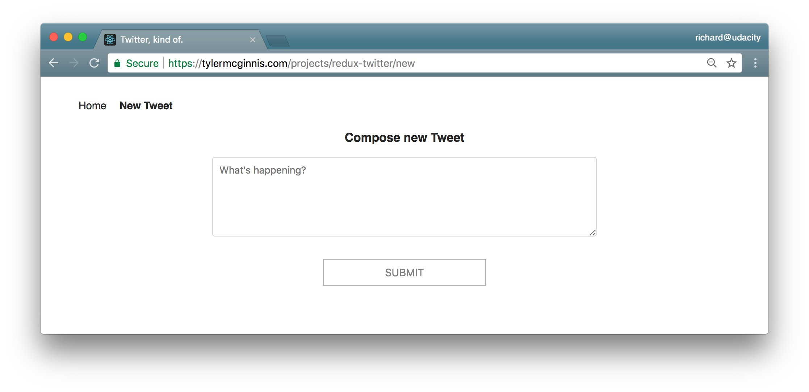

# Chirper Project

This repo is a code-along with the first project in the [React Nanodegree program](https://www.udacity.com/course/react-nanodegree--nd019).

Most of the commits in this repository correspond to videos in the program.

## Project Setup

* clone the Project - `git@github.com:yushanwebdev/reactnd-chirper-app.git`
* install the dependencies - `npm install`

## Planning Stage

### Step 1 - Identify Each View

We need to determine the look and functionality of each view in your app. One of the best approaches is to draw each view of the app on paper so that you'll have a good idea of what information and data you're planning to have on each page.

Instead of paper and pencil, you can be a bit more digital and [use software for creating mockups](https://codingsans.com/blog/mockup-tools). If you were given project specifications, check your mock against them to make sure that you have all of the required features.

For this project, we'll use the screenshots of the app we'll be building instead of mocks.

**View for the Dashboard Page**

Let's start by looking at the Dashboard View.

*
The "dashboard" view displaying the navigation and tweets.
*

**Requirements**
- is located at the home route (`/`)
- shows tweets sorted from most recently added at the top, to oldest at the bottom
- each tweet will show:
  - the author
  - the time stamp
  - who the author is replying to
  - the text of the tweet
  - a reply button - with the number of replies (if higher than 0)
  - a like button - with the number of likes (if higher than 0)

**View for the Tweet Page**

*
The view for a single tweet.
*

**Requirements**
- is located at `/tweet/:id`
- shows an individual tweet
  - the author
  - the time stamp
  - a reply button - with the number of replies (if higher than 0)
  - a like button - with the number of likes (if higher than 0)
- has a reply form
- shows all replies 

**View for Creating a New Tweet**

*
The view for creating a new Tweet.
*

**Requirements**
- is located at `/new`
- has a textbox for adding a new tweet

**Recap**

So these are the 3 views we need in our app: 
- Dashboard
- Tweet
- New Tweet

We now have a clear idea of what we're trying to build and can be confident that our views meet all of the provided requirements.

Now, let's move on to Step 2, where we'll make a conceptual skeleton of our app.

### Step 2 - Break Each View Into a Hierarchy of Components
In this step, we'll do 2 things:
- draw boxes around every component
- arrange our components into a hierarchy

**[Q1] How do you know whether something should be a component in a React app?**

[A1] According to the [Thinking in React docs](https://reactjs.org/docs/thinking-in-react.html#step-1-break-the-ui-into-a-component-hierarchy), the Single Responsibility Principle is a great strategy!

**[Q2] Which of the following are true?**

[A2] 
- Components let you split the UI into independent, reusable chunks.
- Each view typically has a component that represents that view.
- Presentation Components don't know where their data comes from.
- Components that are connected to the store are called "containers".
- Use components to your advantage to isolate specific sections of the app, either as access data (containers) or focused on the UI (presentational).
 
 

**Components for the Dashboard View**

*
Dashboard view broken up into Components.
*

Broke this view into the following React Components:
- **App** - the overall container for the project
- **Navigation** - displays the navigation
- **Tweets List** - responsible for the entire list of tweets
- **Tweet** - in charge of display the content for a single tweet

**Components for the Tweet View**

*
Tweet view broken up into Components.
*

Broke this view into the following React Components:
- **App** - the overall container for the project
- **Navigation** - displays the navigation 
- **Tweet Container** - displays a list of tweets
- **Tweet** - displays the content for a single tweet
- **New Tweet** - display the form to create a new tweet (reply)

**Components for the New Tweet View**

*
New Tweet view broken up into Components.
*

Broke this view into the following React Components:
- **App** - the overall container for the project
- **Navigation** - displays the navigation
- **New Tweet** - display the form to create a new tweet

**All Components**

So from the way I broke things down, the application will have the following components:
- App
- Navigation
- Tweets List
- Tweet Container
- Tweet
- New Tweet

This component hierarchy tells us which components will be used inside of other components. It gives us the skeleton of our app. All of these are presentational components. Right now, we don't care which components will be upgraded to containers. As we start building out the store, we'll create additional components that will be container components to get data from the store and pass it to the presentational components that need the data.

Thus far, we haven't done anything that's special to Redux; all of the steps above are applicable and useful for React applications that do not use Redux. 

Remember that Redux doesn't care about how our app looks or what components it uses. Instead, it gives a way to manage the state of the application in a predictable way. When we talk about state, we're really talking about data - not just any kind of data inside the app, but data that can change based on the events in the app. 

Let's move on to Step 3, where we'll start thinking about the data in this app.

## Contributing

Because this is a code-along project and the commits correspond to specific videos in the program.

If you feel like there's a major problem, please open an issue to discuss the problem and potential resolution.
